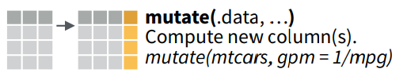
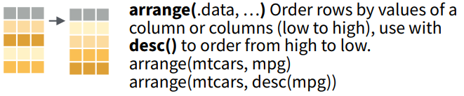

```{r setup, include=FALSE}
library(tidyverse)
library(knitr)

knitr::opts_chunk$set(echo = T, comment = '', warning = F, message = F, eval = T)
```

# Workflow in statistical analysis


# What is the tidyverse ?


A collection of packages that are used to faciliate data exploration, visualization, and 'tidying' of your data.

* **dplyr** - manipulation of data 
* **ggplot2** - visualiation of data
* **readr** - importing data into R
* **tibble** - creation of dataframes in R
* **tidyr** - 'tidying' or 'cleaning' your data
* **purrr** - functional or iterative programming in R

# What is 'tidy' data ?


* Every column should consist of a variable with a single type of data e.g. logical, dbl, integer, character, etc. 
* Every row should consist of a single observation. 
* Every cell should consist of a single value type.

# `dplyr` overview

These are the five main `dplyr` functions that we will used to do the vast majority of data manipulations

* **select observations by their values `filter()`**


* **select variables by their names `select()`**


* **create new variables as functions of other variables `mutate()`**



* **collapse values down to a summary `summarise()`**


* **reordering rows `arrange()`**



# `tidyr` overview

These are the two main `tidyr` functions we will be using

* **collapse data from wide to long format `gather()`**


* **expand data from long to wide format `spread()`**


# The `%>%` (pipe) operator


The pipe operator allows us to chain together multiple functions together. Think of the pipe operator as a method of passing the output of a function to the next function

# Looking up the documentation of any function
```{r}
# ?glimpse
```

# Case study with the sepsis data
## Reading in the data
```{r}
## loading the packages 
library(tidyverse)

## reading in the dataset, here we are using the read_excel() function from the readxl package
df <- readxl::read_excel('data/sepsis_original.xlsx', na = 'NA')

## here we are using the janitor package to help us clean the variable names of the data
df <- janitor::clean_names(df)

## obtaining a glimpse of the dataframe, this allows us to have a quick 'glimpse' or look of the data we just imported
glimpse(df)

## we can see that treat, race, and death are incorrectly coded as 'dbl', we would like to change them into factors using the factors() function. Since we are replacing the previous values with a new one, we need to use it in conjunction with the mutate function to create a new variable

df <-
  mutate(df, treat = factor(
    treat,
    levels = c(0, 1),
    labels = c('0' = 'Control', '1' = 'Ibuprofenol')
  ))

df <- mutate(df, race = factor(
  race,
  levels = c(0, 1, 2),
  labels = c('0' = 'White', '1' = 'African American', '2' = 'Hispanic')
))

df <- mutate(df, death = factor(
  df$death,
  levels = c(0, 1),
  labels = c('0' = 'Alive', '1' = 'Died')
))

## obtain a new glimpse of the data to confirm the variables contain the correct 'typing'
glimpse(df)
```

## Converting the temperature from F to C
```{r}

## we can write the formula to convert a single temp from F to C
mutate(df, temp0 = (temp0 - 32) * 5/9)

## alternatively we can write our own function to do this
fare_to_cel <- function(x) {
  (x - 32) * 5/9
}

## and then apply the function to the selected variables using a 'cousin' of the mutate function
## use ?mutate_at() to get more information on how to use this function
## the below three methods all produce the same results

df %>% mutate_at(
  .,
  c(
    "temp0",
    "temp1",
    "temp2",
    "temp3",
    "temp4",
    "temp5",
    "temp6",
    "temp7",
    "temp8",
    "temp9",
    "temp10",
    "temp11",
    "temp12",
    "temp13",
    "temp14",
    "temp15"
  ),
  fare_to_cel
)

df %>% mutate_at(., 6:21, fare_to_cel)
df %>% mutate_at(., vars(temp0:temp15), fare_to_cel)

## if we are content with the changes, we can save and over ride our original dataframe with the changes 
df <- df %>% mutate_at(., vars(temp0:temp15), fare_to_cel)

```

## Transforming from wide to long and back

<!--  -->

```{r}
## here we are creating a new dataframe called 'long'
long <- df %>% gather(., temp, value, temp0:temp15)
long

## here we are arranging the new dataframe by chronological id
long <- long %>% arrange(., id)
long

## here we are creating a new dataframe called 'wide' by converting the long dataframe back to wide format
## they are both valid formats we can work with in R
wide <- long %>% spread(., temp, value)
wide
```

## Extracting specific observations
```{r}

## to extract specific observations we can use the filter() function, and state a criteria. Here we are extracting only patients in the Control group
df %>% filter(., treat == 'Control')

## here we are extracting white control patients 
df %>% filter(., treat == 'Control' & race == 'White')

## here we are extracting white control patients who died 
df %>% filter(., treat == 'Control' & race == 'White' & death == 'Died')

## here we are extracting white control patients with apache score greater than 10 or who died 
df %>% filter(., (treat == 'Control' & race == 'White' ) & (apache > 10 | death == 'Died'))
```

## Selecting specific columns or variables 
```{r}
## perhaps we wanted to extract a dataframe that only contains id, treat, race, apache, and death
df %>% select(., id, treat, race, apache, death)

## perhaps we wanted to extract only the id and the temp variables 
df %>% select(., id, temp0:temp15)

## perhaps we wanted to extract all the variables except outcome e.g. death
df %>% select(., -death)

## we can also use a numerical indicator of the column number to select a range of columns, e.g the first 5 columns 
df %>% select(., 1:5)
```

## Summarizing data with dplyr
```{r}
## lets taking a simple count of the dataframe
df %>% summarise(., n = n())

## the summzarise function becomes very powerful when you use it in conjuntion with the group_by() function
## lets take the count of control and ibuprofenol patients in our dataset 
df %>% 
  group_by(treat) %>%
  summarise(., n = n())

## we can expand this further by including more factors in group_by()
## here lets take the count of people who died among the different arms
df %>%
  group_by(., treat, death) %>%
  summarise(., n = n())

## we can also further expand this by adding more functions into the summarise function
df %>%
  group_by(., treat, death) %>%
  summarise(., mean_temp0 = mean(temp0, na.rm = T), sd_temp0 = sd(temp0, na.rm = T))

## here we are using a cousin of the summarise function called summarise_at() which allows us to easily summarise many columns at once, with a list of functions
df %>%
  group_by(., treat, death) %>%
  summarise_at(., vars(temp0:temp15), list('mean' = mean, 'sd' = sd), na.rm = T)

```

## More advanced summary table
```{r}
df %>%
  group_by(., treat) %>%
  summarise_at(., vars(temp0:temp15), list('mean' = mean, 'sd' = sd), na.rm = T) %>%
  gather(., key, var, temp0_mean:temp15_sd) %>%
  separate(., 'key', c('temp', 'type')) %>%
  mutate(., temp = as_factor(temp)) %>%
  spread(., type, var) %>%
  modify_if(., is.numeric, ~ round(.x, 2)) %>%
  transmute(., treat, temp, mean_sd = glue::glue('{mean} ({sd})')) %>%
  spread(treat, mean_sd) %>%
  arrange(., temp)
```


